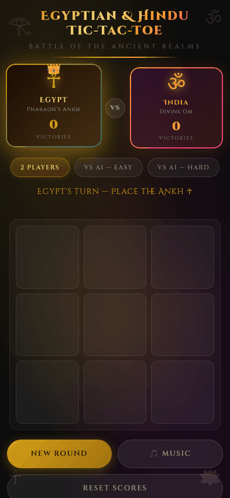

# Egyptian & Hindu Tic-Tac-Toe

> **Battle of the Ancient Realms** — a themed Tic-Tac-Toe game played between an Egyptian Pharaoh and a Hindu deity.

[](https://highviewone.github.io/EgyptianHinduTicTacToe/)



---

## Players

| | Egypt | India |
|---|---|---|
| **Symbol** | ☥ Ankh | ॐ Om |
| **Color** | Gold & Sand | Saffron & Rose |
| **Title** | Pharaoh's Ankh | Divine Om |

## Features

- Classic 3×3 Tic-Tac-Toe rules
- Animated board aura that shifts color per turn and flares on a win
- Player cards highlight with a crown on the active turn
- Cells spring-animate when placed; winning line pulses
- Score tracker persists across rounds (draws counted separately)
- Players alternate who goes first each new round
- AI opponent with Easy (random) and Hard (minimax) difficulty modes
- Procedural sound effects and Bhairav raga background music via Web Audio API
- Fully responsive — works on desktop and mobile
- No dependencies or build step

---

## How it works

### Turn switching

Each move is handled by a single `handleClick(i)` function. After a valid move is placed, `gameState.currentPlayer` is flipped between `'egypt'` and `'hindu'`. Both the board render and the player card highlights read from this value, so the entire UI updates in one pass.

Who goes first alternates each round based on the total number of completed games:

```js
// Even total → Egypt starts; odd total → India starts
gameState.currentPlayer =
  (scores.egypt + scores.hindu + scores.draws) % 2 === 0 ? EGYPT : HINDU;
```

### Win detection

After every move, `checkWinner()` tests all 8 possible winning lines (3 rows, 3 columns, 2 diagonals) against the flat 9-cell board array:

```
0 | 1 | 2
3 | 4 | 5
6 | 7 | 8
```

```js
const WIN_LINES = [
  [0,1,2],[3,4,5],[6,7,8],  // rows
  [0,3,6],[1,4,7],[2,5,8],  // columns
  [0,4,8],[2,4,6],          // diagonals
];
```

If all three cells in a line are occupied by the same player, that player wins. If all 9 cells are filled with no winner, it's a draw. The winning cell indices are passed to `renderBoard()` so only those cells get the pulse animation.

The AI uses the same `WIN_LINES` constant internally for its minimax evaluation.

### Score persistence

All mutable game data lives in a single object:

```js
const gameState = {
  board:         Array(9).fill(null),
  currentPlayer: 'egypt',
  gameOver:      false,
  scores:        { egypt: 0, hindu: 0, draws: 0 },
};
```

`newRound()` resets `board` and `gameOver` but **leaves `scores` untouched**, so the tally carries across rounds. `resetScores()` is the only place that reinitialises `scores`, and it calls `newRound()` afterwards to also clear the board.

---

## Run locally

```bash
git clone https://github.com/HighviewOne/EgyptianHinduTicTacToe.git
cd EgyptianHinduTicTacToe
open index.html   # macOS
# or: xdg-open index.html  (Linux)
# or: start index.html     (Windows)
```

No server or install needed — just open `index.html` in any browser.

---

## Tech

| Layer | Details |
|---|---|
| Structure | `index.html` — semantic HTML |
| Styles | `styles.css` — CSS custom properties, grid, keyframe animations |
| Logic | `script.js` — vanilla JS, Web Audio API, minimax AI |

---

## Future Ideas

- **Multiplayer over the network** — WebSocket-based remote play so two players on different devices can face off
- **Difficulty slider** — intermediate AI levels between random and perfect minimax (e.g. depth-limited search)
- **Animated piece placement** — player-specific entrance animations (sand swirl for Egypt, lotus bloom for India)
- **Theme switcher** — additional cultural matchups (Greek vs Norse, Aztec vs Celtic)
- **PWA / offline support** — service worker so the game installs and runs without a connection
- **Accessibility pass** — full keyboard navigation and screen-reader announcements for each move and result
