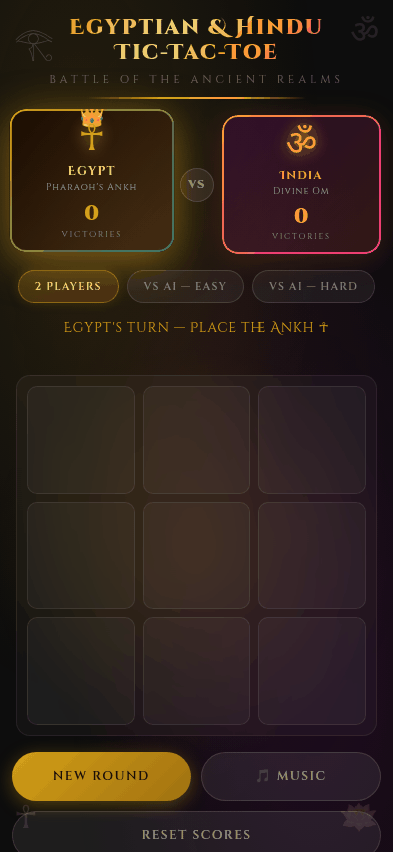

<div align="center">



# Egyptian & Hindu Tic-Tac-Toe
### Battle of the Ancient Realms

[](https://github.com/HighviewOne/EgyptianHinduTicTacToe/actions/workflows/ci.yml)
[](https://github.com/HighviewOne/EgyptianHinduTicTacToe/actions/workflows/pages.yml)
[](game.dom.test.js)
[](LICENSE)


A fully-featured browser Tic-Tac-Toe game with **cinematic cultural themes**, a **strategic minimax AI**, **13 Chaos rules**, **procedural Web Audio music**, **18 achievements**, and a full progression system — built in vanilla HTML / CSS / JS with zero dependencies.

**[▶ Play Live](https://highviewone.github.io/EgyptianHinduTicTacToe/)** · Installable PWA · Works offline

</div>

---

## Table of Contents

- [Quick Start](#quick-start)
- [What Makes This Special](#what-makes-this-special)
- [Themes](#themes)
- [Game Modes](#game-modes)
- [Chaos Mode](#-chaos-mode)
- [Fun Modes](#fun-modes)
- [Board Skins](#board-skins)
- [Tournament Mode](#tournament-mode)
- [Achievements](#achievements)
- [All-Time Stats](#all-time-stats)
- [Keyboard Shortcuts](#keyboard-shortcuts)
- [Procedural Music](#procedural-music)
- [Tech Stack](#tech-stack)
- [File Structure](#file-structure)
- [Running Locally](#running-locally)
- [Development Notes](#development-notes)
- [Deploying Your Fork](#deploying-your-fork)
- [License](#license)

---

## Quick Start

```bash
# No build step needed — open directly in any modern browser
open index.html

# Run the tests and the linter (first time: npm install)
npm test
npm run lint
```

Clone or download the repo, open `index.html`, and play. That's it.

---

## What Makes This Special

Standard Tic-Tac-Toe is solved — but this isn't standard Tic-Tac-Toe.

- **Cultural immersion**: Five historical themes (Ancient Egypt, Hindu mythology, Greek vs Norse, Chinese Dragon/Phoenix, Samurai vs Ninja) each come with unique symbols, color palettes, procedurally generated music in the theme's modal scale, five historically-grounded lore facts, per-player quips, and themed win messages.
- **Chaos Mode**: 1–3 randomly chosen rules from a 13-rule catalogue activate each round — pieces teleport, swap allegiances, get smited by lightning, or players lose their turn entirely. Every game is different.
- **Strategic depth**: Three AI levels (Easy / Medium / Hard) where Hard uses full minimax with alpha-beta pruning. The position evaluation bar shows who's winning in real time. Move quality badges (✓ / ≈ / ✗) rate each decision.
- **AI vs AI Demo**: Watch two Hard AIs battle each other continuously, with opening move announcements and auto-restart.
- **Accessible**: full keyboard play, screen-reader labels for the board and controls, proper dialogs, and a reduced-motion mode that keeps every highlight visible.

---

## Themes

Five named themes plus a ✦ **Random** mode that procedurally generates a new palette and symbol pair every time.

| Theme | Player 1 | Player 2 | Vibe |
|---|---|---|---|
| ☥ Egypt vs India | Egypt ☥ | India ॐ | Golden desert meets cosmic lotus |
| ✕ Classic X vs O | X | O | Clean, ruthless geometry |
| ⚡ Greek vs Norse | Greece ⚡ | Norse ⚔️ | Olympus vs Asgard |
| 🐉 Dragon vs Phoenix | Dragon 龍 | Phoenix 鳳 | Chinese pentatonic mythology |
| ⚔ Samurai vs Ninja | Samurai ⛩ | Ninja 🥷 | Honor vs shadow |

Each theme ships with:
- Unique placement sounds (Web Audio API, no files)
- Modal-scale procedural background music + LFO drone
- 5 lore facts (📖 Lore button) and per-player quips
- 3 randomised win messages per player

---

## Game Modes

| Mode | Behaviour |
|---|---|
| 2 Players | Local hot-seat |
| vs AI — Easy | Random moves |
| vs AI — Medium | Always takes a winning move and blocks yours; otherwise 35 % random, else minimax. Beatable with forks |
| vs AI — Hard | Full minimax + alpha-beta pruning (unbeatable); takes immediate wins |
| 👁 AI Demo | AI vs AI — watch Hard play itself, auto-restarts. Demo games don't count toward stats or achievements |

**Undo** (`U`, ↩ button, or swipe left on the board) works mid-game and right after a game ends — undoing a finished game also takes back its score and stats (achievements already earned stay).

---

## ⚡ Chaos Mode

Toggle Chaos mode to activate 1–3 randomly chosen rules each round. Active rules display in a chip bar above the board.

| Rule | Icon | Effect |
|---|---|---|
| Wild Turn | 🎲 | Once per round, a placed piece teleports to a random empty square |
| Swap Souls | 🔄 | Two pieces switch allegiances mid-game |
| Ghost Move | 👻 | One piece becomes spectral — barely real, barely counts |
| Smite | ⚡ | A divine bolt obliterates a random enemy piece |
| Blessing of Twofold | ✨ | One lucky player claims two squares in a single turn |
| Cursed Skip | 💀 | A player's next turn is silently, divinely skipped |
| Mirror Realm | 🪞 | The board is horizontally reflected |
| Chaos Storm | 🌪 | The board shakes violently after every move |
| Solar Flare | 🌟 | A blinding flash strikes at the worst moment |
| Divine Lag | ⏳ | All input freezes for 3 celestial seconds |
| Holy Ground | ⛪ | One cell is cursed — no piece may be placed there (if it's the last empty cell, the game is a draw) |
| Phantom Veil | 👁 | All pieces vanish from sight for 1.5 seconds |
| Treachery | 🗡 | 25 % chance a newly placed piece betrays its owner |

---

## Fun Modes

| Button | Effect |
|---|---|
| ✨ Cosmic | Board rotates 3° per turn, accumulating over the game |
| 🌪 Storm | Board shakes randomly on 38 % of turns |
| ⚡ Chaos | Activates the Chaos rules system |
| ⏱ Timed | 15-second move timer; random move placed on expiry |
| ⛶ Full | Toggle fullscreen |
| 👁 Demo | AI vs AI spectator mode — auto-restarts each game |

---

## Board Skins

Three visual styles selectable via 🪨 🏛 ⚡ buttons between the board and controls:

| Skin | Look |
|---|---|
| 🪨 Stone | Default dark parchment |
| 🏛 Marble | Warm cream cell backgrounds with earthy borders |
| ⚡ Neon | Deep black with glowing piece halos in theme colors |

---

## Tournament Mode

Select **Best of 3 / 5 / 7** from the Match row. Pip indicators on each player card fill as they win rounds. A full-screen match victory overlay fires when a player reaches the winning threshold. Preference persists across reloads.

---

## Achievements

18 unlockable achievements stored in `localStorage`. A slide-in toast confirms each unlock; multiple unlocks queue gracefully. Achievements are earned by human players only — never in AI Demo mode or when the AI wins.

| Achievement | Condition |
|---|---|
| ⚔️ First Blood | Win any game |
| ⚖️ Equilibrium | Draw a game |
| 🔥 On Fire | Win 3 games in a row |
| 🔥 Unstoppable | Win 5 games in a row |
| 🤖 Machine Breaker | Defeat the Hard AI |
| ⚡ Lord of Chaos | Win a round with Chaos mode on |
| 🌪 Chaos Champion | Win with all 3 chaos rules active simultaneously |
| ⏱ Speed Demon | Win while Timed mode is on |
| 🏆 Match Master | Win a Best of 5 or 7 match |
| 👑 Undisputed | Win a Best of 3 without dropping a round |
| 🔄 Comeback King | Win a match after trailing 0–2+ in a Bo5+ |
| ✨ Cosmic Champion | Win with Cosmic mode on |
| 🌍 Pilgrim of Ages | Play all 5 named themes |
| 🐉 Dragon Lord | Win a game with the Dragon vs Phoenix theme |
| 💨 Lightning Strike | Win in the minimum 5 moves |
| 🌙 Night Owl | Play between 22:00 and 04:00 |
| 🎯 Pure Intuition | Win a game without ever using the Hint button |
| ⭐ Perfect Execution | Win a game making only optimal moves |

---

## All-Time Stats

The 📊 Stats button opens a modal showing:
- Cumulative games played, draws, per-player wins
- Best win streak
- Player-1 win rate
- Last 10 games as colored result dots
- **Cell hot-spots heatmap**: 3×3 grid showing which cells human players pick most often (persisted across sessions)

AI Demo games are not counted.

---

## Keyboard Shortcuts

| Key | Action |
|---|---|
| `1`–`9` | Place on cell (reading order; top-left = 1) |
| `Numpad 1`–`9` | Place on cell (board-intuitive; Numpad 7 = top-left) |
| `N` | New round |
| `M` | Toggle music |
| `Arrow keys` + `Enter`/`Space` | Move around the board and place a piece |
| `U` | Undo last move |
| `H` | Show move hint (pulses best cell for 1.8 s) |
| `A` | Open/close post-game analysis |
| `R` | Replay last game |
| `S` | Toggle AI demo mode |
| `C` | Chaos rule picker (when Chaos is on) |
| `F` | Toggle fullscreen |
| `?` | Toggle keyboard shortcut help panel |
| `Escape` | Close overlays |

Shortcuts are ignored while you're typing a player name.

---

## Procedural Music

Each theme has its own modal scale, melody pattern, step tempo, and drone frequencies built from Web Audio API oscillators — no audio files required. Music crossfades on theme change and layers an LFO-modulated ambient drone beneath the melody. Two **volume sliders** control sound effects and music separately. Browsers block audio until you interact with the page, so sound starts after your first click, tap or keypress.

---

## Tech Stack

| Layer | Technology |
|---|---|
| Structure | Semantic HTML5 |
| Styling | CSS3 — custom properties, Grid, Flexbox, animations |
| Logic | Vanilla ES5-compatible JavaScript (no framework, no bundler) |
| AI | Minimax algorithm with alpha-beta pruning |
| Audio | Web Audio API — oscillators, gain, LFO |
| Persistence | `localStorage` |
| Offline | Service Worker (network-first, cache fallback — always fresh online, playable offline) |
| Install | Web App Manifest (PWA) |
| Testing | Jest (unit tests) + jsdom with fake timers (integration tests that boot the real page) — 78 tests, ESLint |
| CI/CD | GitHub Actions → GitHub Pages |

---

## File Structure

```
index.html          static shell and all overlays
manifest.json       PWA manifest (installable, offline-ready)
sw.js               service worker — network-first, offline fallback
icon.svg            app icon
styles.css          CSS custom-property theming system (~1 800 lines)
data.js             all static data: themes, chaos rules, quips, achievements
audio.js            Web Audio API — sound effects + procedural background music
ai.js               minimax (depth-aware, alpha-beta pruning) + mode management
chaos.js            Chaos mode: rule state, picking/config, rules bar, overlay
stats.js            all-time stats, ranks, achievements, move log, analysis
board.js            board drawing: cells, grid/win lines, seal, eval bar, hint, replay
themes.js           apply/generate themes, intro, lore popup, papyrus ornaments
script.js           game state, move handling (handleClick), rounds, undo,
                    save/restore, prefs, keyboard/touch input, startup
eslint.config.js    lint config (all game files share one global scope)
gameLogic.js        pure game logic — board, win detection, Holy Ground blocking
gameLogic.test.js   unit tests — game logic and AI move choice
game.dom.test.js    integration tests — boots index.html in jsdom with fake timers
LICENSE             MIT
```

### localStorage Keys

| Key | Contents |
|---|---|
| `ehttt` | Preferences: theme, AI mode, fun modes, match length |
| `ehttt-stats` | All-time stats: games, wins, draws, streaks, cell frequency |
| `ehttt-ach` | Unlocked achievements + themes-played tracking |
| `ehttt-game` | In-progress game, offered for restore on the next visit |

---

## Running Locally

Open `index.html` directly in any modern browser — no build step or server required.

```bash
# Clone
git clone https://github.com/HighviewOne/EgyptianHinduTicTacToe.git
cd EgyptianHinduTicTacToe

# Play (macOS)
open index.html

# Run the tests and the linter
npm install
npm test
npm run lint
```

---

## Development Notes

A few conventions keep the game's many timers and chaos rules from interfering with each other:

- **Round-scoped timers** — any delayed action that belongs to the current round (a toast, a status restore, the win seal…) must use `roundTimeout(fn, ms)`, not `setTimeout`. `newRound()` and `undo()` cancel them all, so nothing fires into the next round. Plain `setTimeout` is only for cosmetic cleanup that must always run, like removing an animation class.
- **AI moves** — `scheduleAI()` / `scheduleSpectatorAI()` store their pending move in `aiTimer`; call `cancelAI()` whenever the board is replaced.
- **Holy Ground** — anything that picks or checks a move (AI, hints, move timer, win/draw check) should use `rulesBoard()`, which marks the forbidden cell as unplayable.
- **Adding a script file** — add its `<script>` tag to `index.html` (before `script.js`, which runs startup) and to `ASSETS` in `sw.js`. The tests, linter and deploy read the list from `index.html`; a test checks `sw.js`.
- **Tests** — `game.dom.test.js` loads the real page, so a new bug can usually be reproduced there first: drive it with `clickCell`, `key` and `clock.tick`, and control randomness with `setRandom`.

---

## Deploying Your Fork

The repo includes a GitHub Actions workflow (`.github/workflows/pages.yml`) that publishes the site automatically on every push to `main`.

1. Go to **Settings → Pages** and set Source to **GitHub Actions**.
2. Push to `main` — the workflow deploys in ~30 seconds.
3. Your live URL will be `https://<username>.github.io/EgyptianHinduTicTacToe/`.

---

## License

[MIT](LICENSE)
